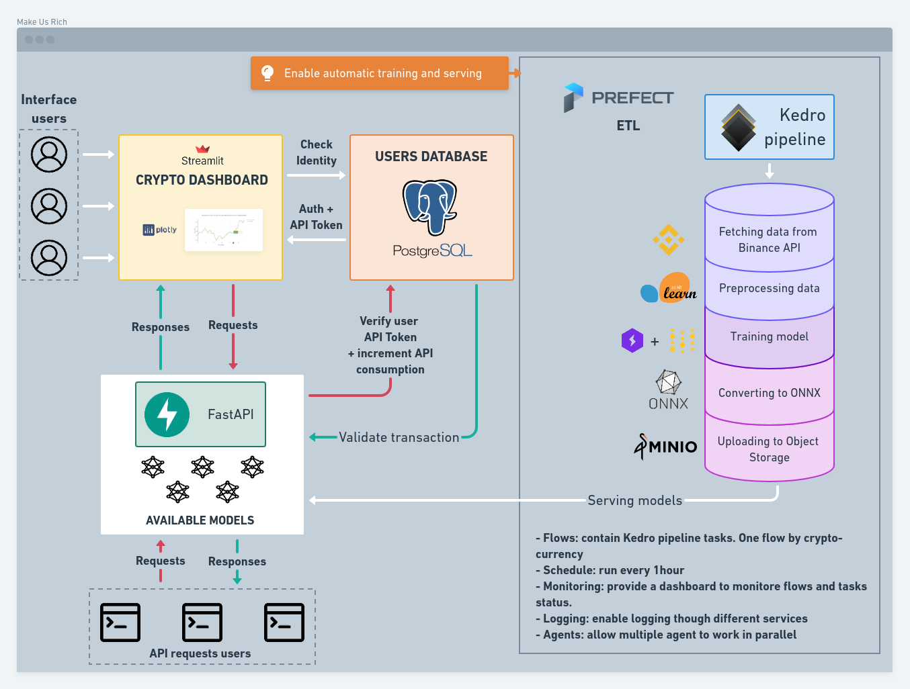
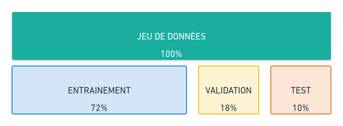

# Make Us Rich

Cryptocurrency forecasting 📈 
training and serving models made automatic

###### *Thomas Chaigneau - Mai 2022*

---
<!-- _class: lead -->

## Sommaire

1. Qu'est-ce que `Make Us Rich` ❓
2. Démonstration 🎥
3. Crypto-monnaies et données
4. Les RNNs: GRU & LSTM
5. Entraînement 🏋️‍♀️
6. Stockage et base de données
7. API et serving
8. Interface utilisateur
9. Conclusion

---

Qu'est ce que 
`Make Us Rich` ❓

---
<!-- _class: lead -->
##### Architecture du projet

---
# Démonstration 🎥

---
<!-- _class: lead -->

### <!--fit--> Crypto-monnaies et données

**Binance API:**
timestamp, open, high, low, close, volume, close_time, quote_av, trades, tb_base_av, tb_quote_av, ignore

---
<!-- _class: lead -->

### <!--fit--> Crypto-monnaies et données

**Binance API:**
* *timestamp*
* *open*
* *high*
* *low*
* *close_change* $_{(close - open)}$
* **close**

---

### <!--fit--> Répartition des données

---
<!-- _class: lead -->

---
<!-- _class: lead -->
