# Door Detector 🚪

[](http://www.youtube.com/watch?v=pPVfg5bXbA0 "Door Detector Demo")

---

# Make Us Rich

Cryptocurrency forecasting 📈 
training and serving models made automatic

###### *Thomas Chaigneau - Mai 2022*

---
<!-- _class: lead -->

## Sommaire

1. Qu'est-ce que `Make Us Rich` ❓
2. Démonstration 🎥
3. Crypto-monnaies et données
4. Les RNNs: GRU & LSTM
5. Entraînement 🏋️‍♀️
6. Stockage et base de données
7. API et serving
8. Interface utilisateur
9. Conclusion

---


Qu'est ce que 
`Make Us Rich` ❓

---
<!-- _class: lead -->
##### Architecture du projet


---
# Démonstration 🎥

[](http://www.youtube.com/watch?v=u0jEt9UfI0I "Make Us Rich Demo")

---
<!-- _class: lead -->

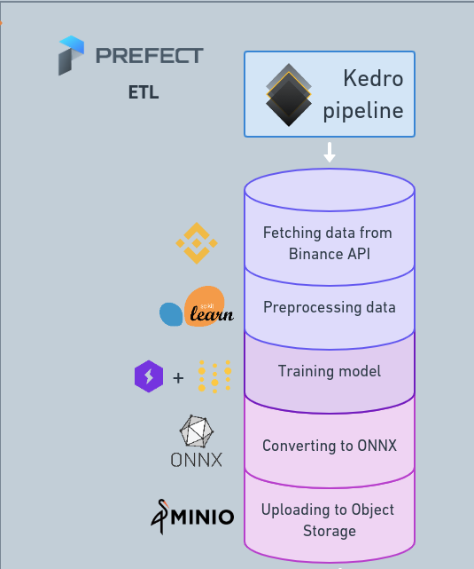

---
<!-- _class: lead -->


### <!--fit--> Crypto-monnaies et données

**Binance API:**
timestamp, open, high, low, close, volume, close_time, quote_av, trades, tb_base_av, tb_quote_av, ignore

---
<!-- _class: lead -->


### <!--fit--> Crypto-monnaies et données

**Binance API:**
* *timestamp*
* *open*
* *high*
* *low*
* **close**
* *close_change* $_{(close - open)}$


---
<!-- _class: lead -->

# Normalisation des données

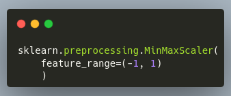

$$
x' = 2\frac{x - min(x)}{max(x) - min(x)} - 1
$$

---
<!-- _class: lead -->

#### Création de séquences à partir des données normalisées

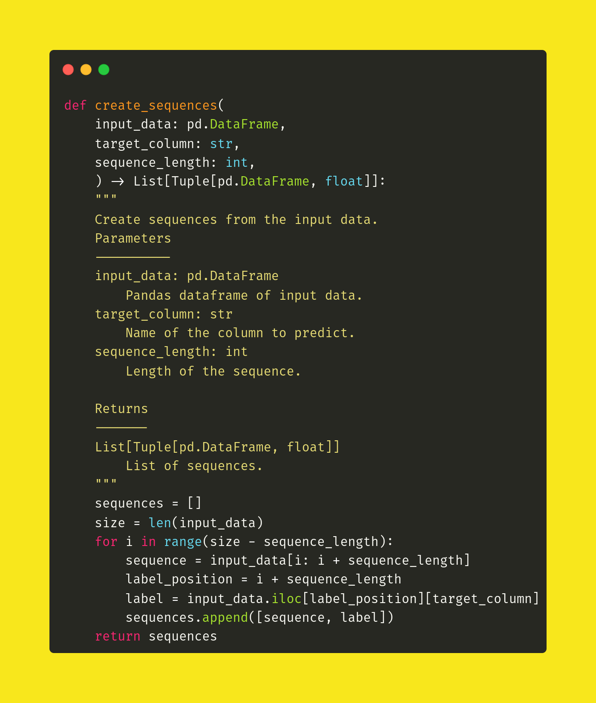

---
<!-- _class: lead -->

# Les RNNs: GRU & LSTM


Architecture d'un RNN

---
<!-- _class: lead -->
# Les RNNs: GRU & LSTM


---
<!-- _class: lead -->

## Pourquoi LSTM ❓

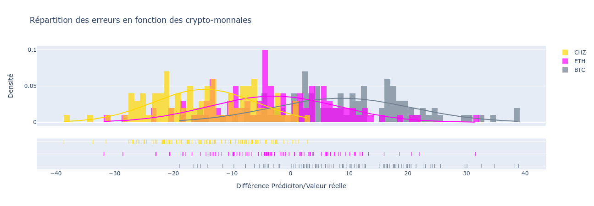

---
<!-- _class: lead -->

## Entraînement

 
## +


---
<!-- _class: lead -->

## Fonction coût à minimiser

`torch.nn.MSELoss()`

$$
l_{n} = (x_{n} - y_{n})^{2}
$$
---

### <!--fit--> Répartition des données


(8.64 mois, 2.16 mois et 1.2 mois)


---
<!-- _class: lead -->

## Hyperparamètres

```yaml
train_batch_size: 64
val_batch_size: 1
train_workers: 2
val_workers: 1
max_epochs: 100
hidden_size: 128
number_of_features: 9
number_of_layers: 2
dropout_rate: 0.2
learning_rate: 0.0001
log_n_steps: 2
run_on_gpu: True # False if running on CPU
wandb_project: "make-us-rich"
```

---
<!-- _class: lead -->


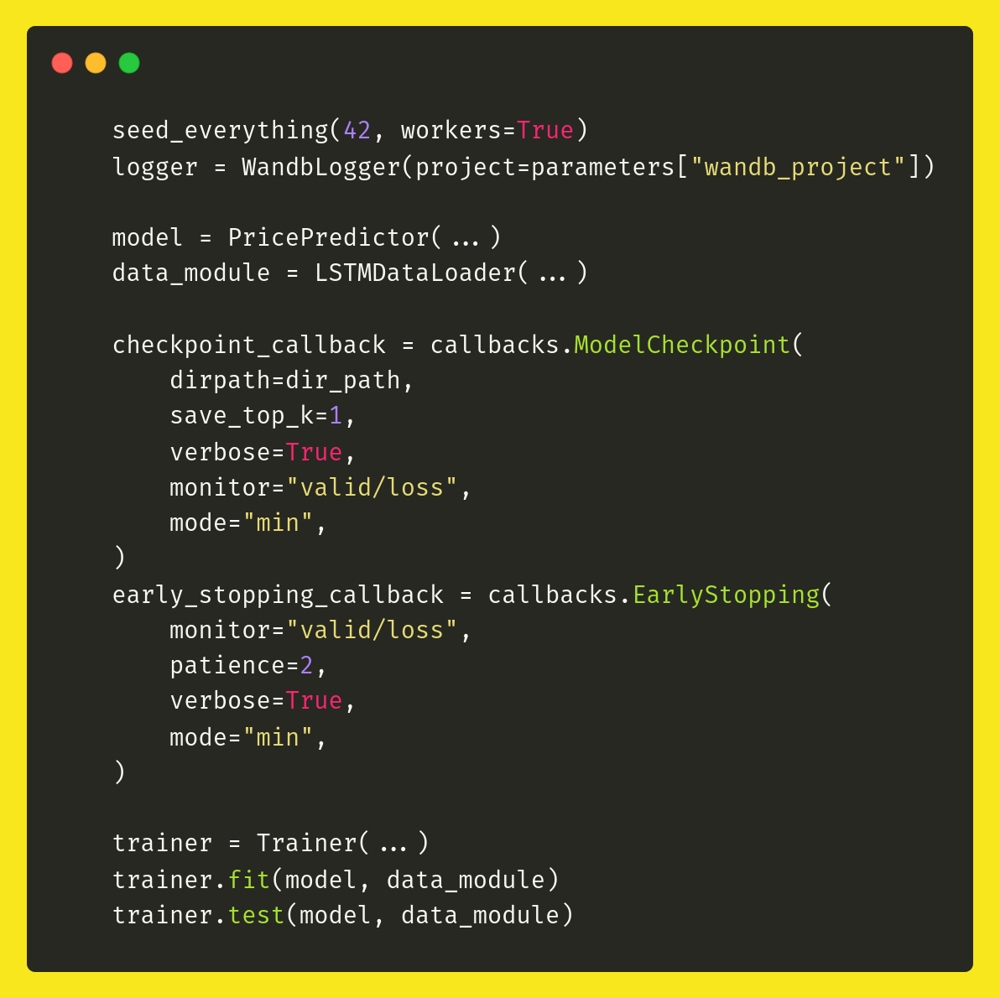

## Training Loop


* seed + logger
* model
* data module
* trainer

---
<!-- _class: lead -->


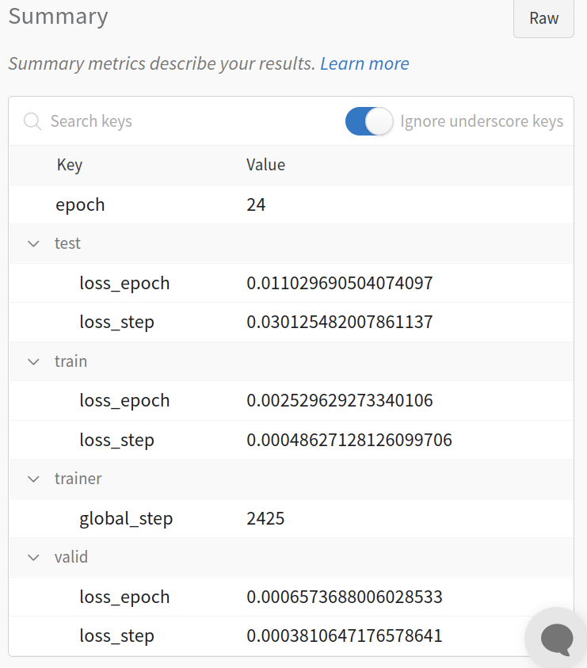
## Métriques

Monitoring des métriques d'entraînement

---
<!-- _class: lead -->

## Stockage et base de données

* Fichiers modèles et features engineering

* Utilisateurs de l'interface et API


---
<!-- _class: lead -->

## Base de données relationnelle

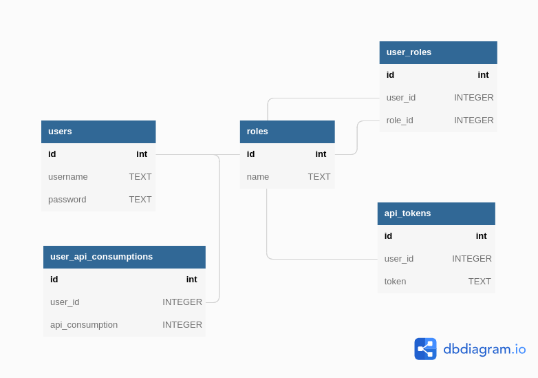

---
<!-- _class: lead -->

## Serving via API

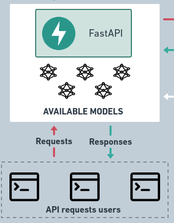

---
<!-- _class: lead -->

## Gestion des modèles

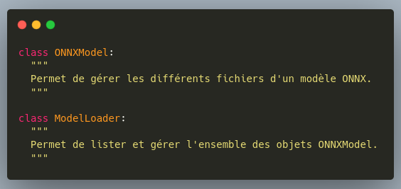

---
<!-- _class: lead -->

## Les Endpoints

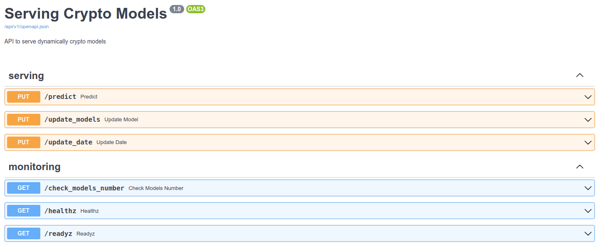

---

## L'interface utilisateur

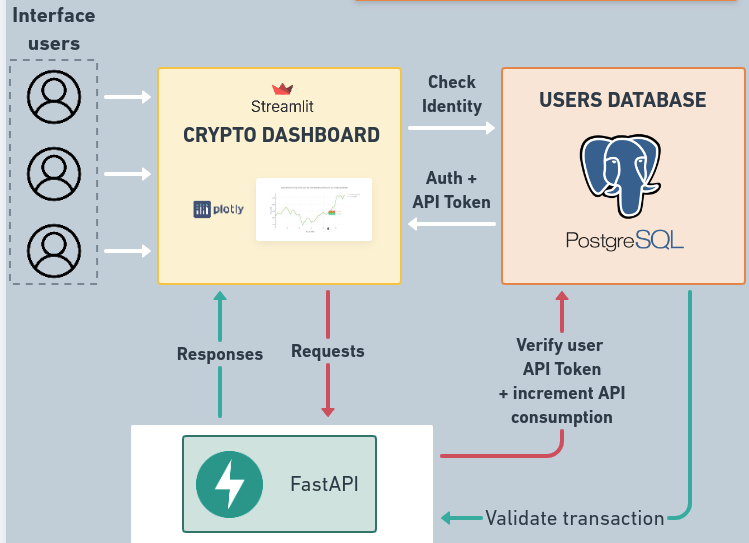

---
<!-- _class: lead -->

### Authentification

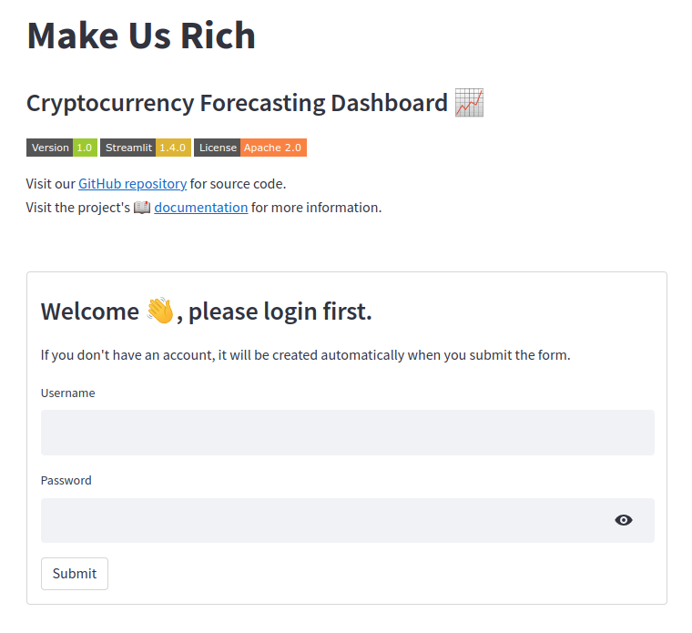

---
<!-- _class: lead -->

### Graphiques avec prédictions

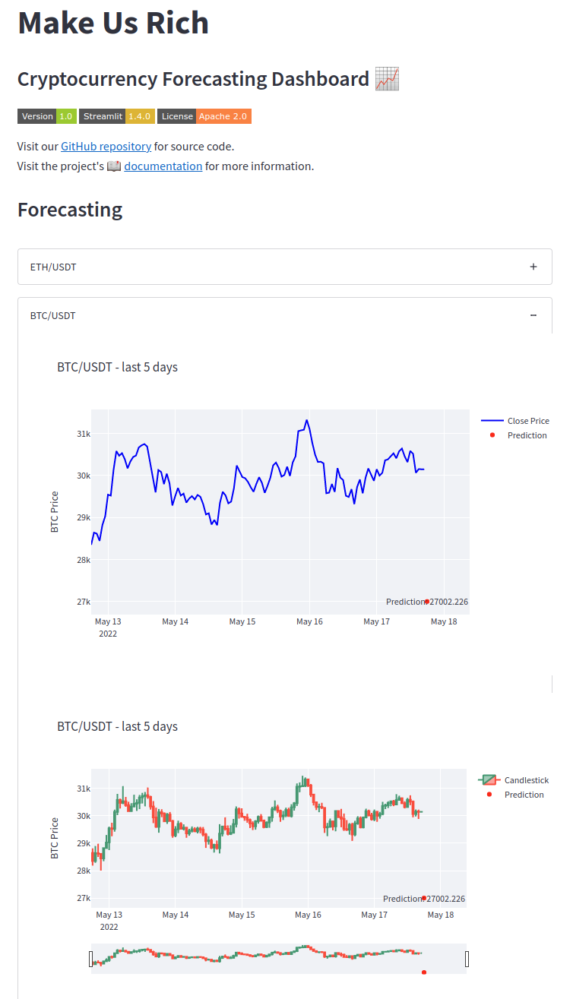

---
<!-- _class: lead -->

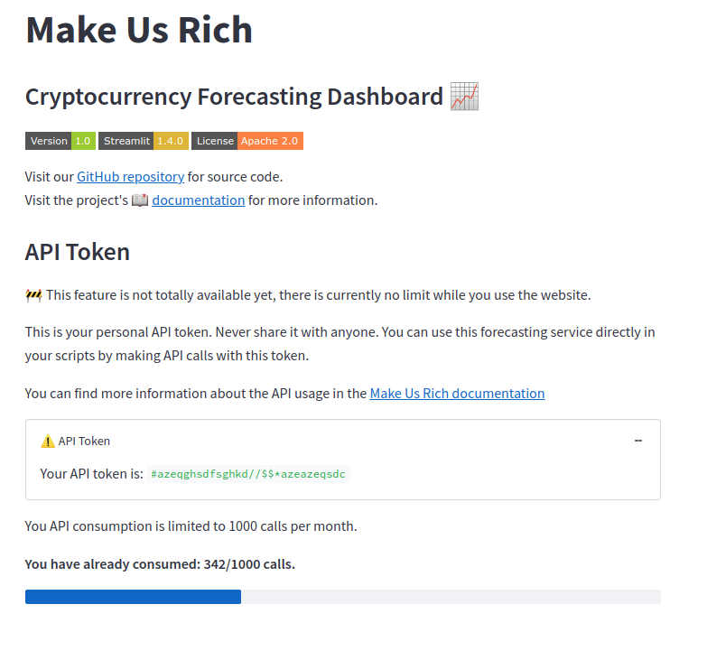

---
<!-- _class: lead -->

## Organisation

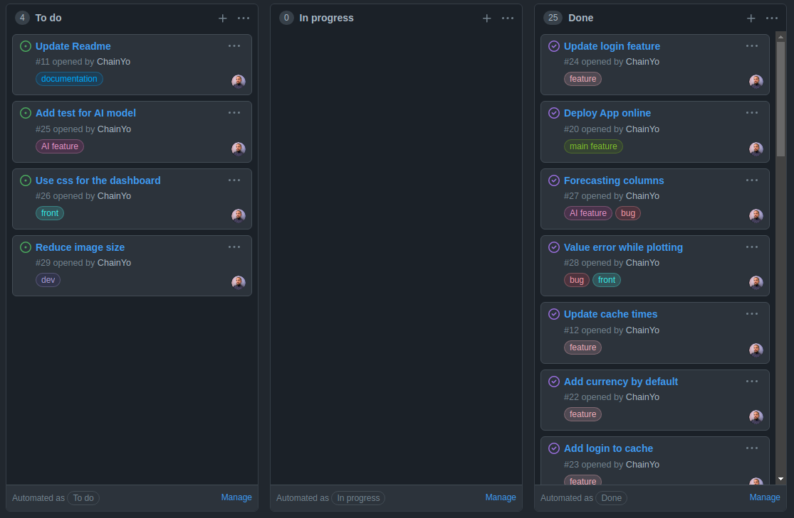

---

## Conclusion


---
<!-- _class: lead -->

# Questions ❓
